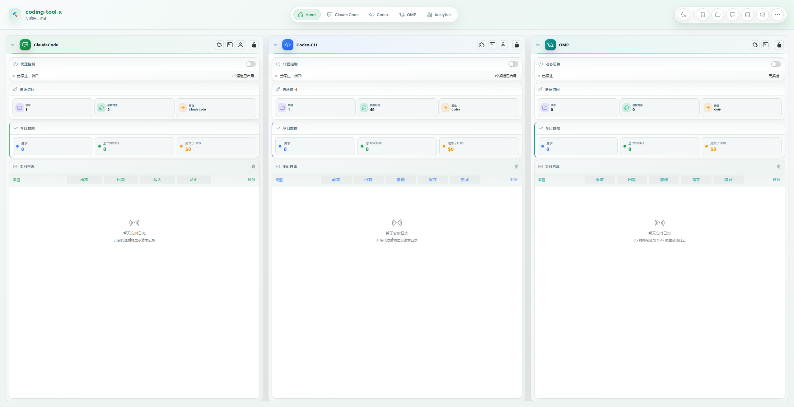

# coding-tool-x

> 面向 Claude Code、Codex CLI、Gemini CLI、OpenCode、OMP 的统一增强控制台
> Web UI + CLI + 多平台代理 + 配置托管 + 工作区编排 + 分析面板




`coding-tool-x` 把多个 Coding CLI 的常用管理能力收拢到一套界面里: 会话查看、渠道代理、配置同步、工作区组织、MCP / Skills / Commands / Agents / Plugins 管理、OAuth 凭证托管、通知设置、统计分析和配置导入导出。

如果你同时在用 Claude Code、Codex CLI、Gemini CLI、OpenCode、OMP，这个项目的目标就是把这些分散在不同目录、不同配置文件、不同命令里的日常操作，尽量放回一个统一入口。

## 适合做什么

- 统一查看五个平台的项目和会话
- 管理多渠道代理、测速、模型探测和健康状态
- 集中托管 Prompts、Skills、Agents、Commands、MCP、Plugins 等常用配置项
- 为多项目创建工作区，必要时自动创建 Git worktree
- 统一查看请求量、Token、费用趋势与实时日志
- 导入导出整套配置，包含原生配置快照

## 功能概览

### 会话与项目

- 支持 Claude、Codex、Gemini、OpenCode、OMP 五个平台的项目与会话列表
- 支持项目排序、项目搜索、会话排序、会话搜索
- 支持最近会话、收藏、别名、聊天记录查看
- 支持新建会话、删除会话、复制启动命令
- Claude / Codex / Gemini 会话支持格式转换
- 支持将 Claude / Codex / Gemini 请求转换为 OpenCode 网关请求

### 多渠道代理

- 五个平台均支持独立代理端口和独立渠道配置
- 支持渠道增删改查、启用 / 停用、权重、并发限制
- 支持速度测试、模型可用性探测、健康检查与故障冻结
- 支持模型重定向和默认测速模型配置
- Web UI 与 CLI 都可查看代理状态和日志

### 配置与托管

- 集中存储在 `~/.cc-tool`
- 保留并同步各平台原生配置目录，而不是替代原生用法
- 支持 Prompts 预设管理，并同步到 Claude、Codex、Gemini、OpenCode 对应提示文件；OMP 同步为原生 prompt templates
- 支持 Skills、Agents、Commands、Plugins 的中心托管与按支持的平台启停
- OMP Commands 按 OMP 原生语义管理为 slash commands，OMP Plugins 按 packages / extensions 管理
- 支持 MCP 服务器配置、预设、连通性测试和多平台写入；OMP 写入原生 `mcp.json`
- 支持 Claude、Codex、Gemini、OpenCode 的 OAuth 凭证池管理与回写原生配置；OMP auth 通过原生配置导入导出保留
- 支持 ZIP / JSON 配置导入导出

### 工作区与运维

- 支持多项目工作区
- 支持为 Git 仓库创建 worktree
- 支持配置模板，将提示词、技能、命令、代理、MCP、插件组合成一套模板
- 支持 Dashboard、Analytics、日志、统计导出、环境诊断
- 支持面板访问密码
- LAN 模式默认禁止远程写操作，可按需开启

### 通知

- 支持 Claude、Codex、Gemini、OpenCode、OMP 的任务完成通知托管
- 支持系统通知、浏览器通知和弹窗模式
- 支持飞书机器人 Webhook 通知

## 能力矩阵

| 能力 | Claude | Codex | Gemini | OpenCode | OMP |
| --- | --- | --- | --- | --- | --- |
| 项目 / 会话查看 | 支持 | 支持 | 支持 | 支持 | 支持 |
| 渠道 / 代理管理 | 支持 | 支持 | 支持 | 支持 | 支持，含余额显示与批量测速 |
| Prompts 预设同步 | 支持 | 支持 | 支持 | 支持 | 写入 OMP prompt templates |
| Skills 管理 | 支持 | 支持 | 支持 | 支持 | 原生支持 |
| Commands 管理 | 支持 | 支持 | 支持 | 支持 | 映射为 OMP commands |
| Agents 管理 | 支持 | 用户级 | 支持 | 支持 | 不提供直接原生管理 |
| Plugins 管理 | 支持 | 支持 | - | 支持 | 映射为 packages / extensions |
| MCP 管理 | 支持 | 支持 | 支持 | 支持 | 写入 OMP `mcp.json` |
| OAuth 凭证托管 | 支持 | 支持 | 支持 | 支持 | 原生 auth 导入导出，不提供 OAuth 抽屉托管 |
| 通知托管 | 支持 | 支持 | 支持 | 支持 | 支持 |
| 请求 / 会话统计 | 支持 | 支持 | 支持 | 支持 | 共享统计优先，空时回退到 OMP session usage |

补充说明:

- Codex Agents 目前仅支持用户级代理
- OpenCode 会话读取依赖本机 `sqlite3`
- OMP 的原生资源轴包含 skills、commands、prompt templates、packages / extensions 和 MCP `mcp.json`；Agents 暂不作为独立可写配置文件管理
- OMP 在内部继续使用兼容平台键 `pi`，用户界面显示为 OMP，启动命令使用 `omp`
- OMP OAuth 不在 OAuth Credentials 抽屉中直接增删改；`auth.json` 仍随 Config Export / Import 的 native config 快照迁移

## 安装

### 全局安装

```bash
npm install -g coding-tool-x
```

### 国内镜像

```bash
npm install -g coding-tool-x --registry=https://registry.npmmirror.com
```

### 从源码运行

```bash
git clone https://github.com/ZeaoZhang/coding-tool.git
cd coding-tool
npm install
npm run build:web
npm link
```

## 环境要求

- Node.js `>= 14.0.0`
- 建议至少运行过一次目标 CLI，以便生成原生配置目录
- 如需读取 OpenCode 会话，请确保系统里有可用的 `sqlite3`

## 快速开始

### 推荐方式

```bash
ctx start
ctx status
```

启动后默认访问:

- Web UI: `http://localhost:19999`

### 前台运行

```bash
ctx ui
```

### 本地 HTTPS

```bash
ctx ui --https
```

如需后台运行 HTTPS 版本，可使用 `ctx ui start --https`。

### 开启局域网访问

```bash
ctx ui --host
```

LAN 模式说明:

- 服务会监听 `0.0.0.0`
- 默认只允许本机执行写操作
- 如确需允许远程写操作，可显式设置:

```bash
CC_TOOL_ALLOW_REMOTE_WRITE=true ctx ui --host
```

### 单独控制平台代理

```bash
ctx claude start
ctx codex start
ctx gemini start
ctx opencode start
ctx pi start
```

## 常用命令

### 服务

| 命令 | 说明 |
| --- | --- |
| `ctx start` | 后台启动整套服务 |
| `ctx stop` | 停止后台服务 |
| `ctx restart` | 重启后台服务 |
| `ctx status` | 查看后台服务状态 |
| `ctx ui` | 前台启动 Web UI |
| `ctx ui --https` | 前台启动本地 HTTPS Web UI |
| `ctx ui start` | 后台启动 Web UI |
| `ctx ui start --https` | 后台启动本地 HTTPS Web UI |
| `ctx ui stop` | 停止后台 Web UI |
| `ctx ui restart` | 重启后台 Web UI |

### 平台代理

| 命令 | 说明 |
| --- | --- |
| `ctx claude start\|stop\|restart\|status` | Claude 代理管理 |
| `ctx codex start\|stop\|restart\|status` | Codex 代理管理 |
| `ctx gemini start\|stop\|restart\|status` | Gemini 代理管理 |
| `ctx opencode start\|stop\|restart\|status` | OpenCode 代理管理 |
| `ctx pi start\|stop\|restart\|status` | OMP 代理管理（保留 `pi` 命令键兼容旧路由） |

### 日志与统计

| 命令 | 说明 |
| --- | --- |
| `ctx logs` | 查看所有日志 |
| `ctx logs ui` | 查看 UI 日志 |
| `ctx logs claude` | 查看 Claude 代理日志 |
| `ctx logs --follow` | 实时追踪日志 |
| `ctx logs --lines 100` | 查看最近 100 行 |
| `ctx logs --clear` | 清空日志 |
| `ctx stats` | 查看总体统计 |
| `ctx stats claude` | 查看单个平台统计 |
| `ctx stats export` | 导出统计数据 |
| `ctx doctor` | 运行环境诊断 |

### 其他

| 命令 | 说明 |
| --- | --- |
| `ctx update` | 检查并更新版本 |
| `ctx port` | 修改默认端口 |
| `ctx reset` | 重置 `~/.cc-tool` 配置 |
| `ctx security reset` | 关闭面板访问密码 |
| `ctx plugin list` | 查看已安装插件 |
| `ctx plugin install <git-url>` | 从 Git 安装插件 |

兼容说明:

- `ctx proxy start|stop|status` 仍保留为旧入口
- 新用法更推荐 `ctx claude ...`、`ctx codex ...`、`ctx gemini ...`、`ctx opencode ...`、`ctx pi ...`

## Web UI 主要模块

### Home / Dashboard

- 五个平台可配置状态卡，默认保持四列展示
- 新启动的平台默认前置展示
- 展示代理状态、今日请求、Token、费用、项目数、会话数

### 项目与会话

- 项目列表、会话列表
- 全局搜索和项目内搜索
- 聊天历史查看
- 收藏、别名、删除、复制启动命令，部分平台支持 Fork

### 配置管理

- Prompts
- MCP
- Skills
- Commands
- Agents
- Plugins
- OAuth Credentials
- Config Export / Import

### 工作区与模板

- Workspaces
- Config Templates
- Git worktree 组织

### Analytics

- 多平台统计汇总
- 模型 / 渠道 / 工具维度分析
- 时间范围筛选
- CSV / JSON 导出

## 默认端口

| 服务 | 默认端口 |
| --- | --- |
| Web UI / WebSocket | `19999` |
| Claude Proxy | `20088` |
| Codex Proxy | `20089` |
| Gemini Proxy | `20090` |
| OpenCode Proxy | `20091` |
| OMP Proxy | `20092` |

可通过 `ctx port` 修改。

## 数据目录

### 中央目录

默认位于:

```text
~/.cc-tool
```

常见内容:

- `config/`: 主配置、Prompts、MCP、OAuth、工作区、模板等
- `configs/`: 托管的 skills / commands / agents / plugins
- `storage/`: 渠道、缓存、统计、内部运行数据
- `logs/`: 服务与代理日志
- `plugins/`: 插件安装与插件配置

### 原生配置目录

项目会继续读写各平台原生配置:

- Claude: `~/.claude`
- Codex: `${CODEX_HOME:-~/.codex}`
- Gemini: `~/.gemini`
- OpenCode:
  - 配置: `~/.config/opencode`
  - 数据: `~/.local/share/opencode`
- OMP: `${PI_CODING_AGENT_DIR:-~/.omp/agent}`（`OMP_PROFILE` 会落到 `~/.omp/profiles/<name>/agent`，`PI_CODING_AGENT_DIR` 保留为兼容覆盖项）

## 开发

### 安装依赖

```bash
npm install
```

### 启动前端开发服务器

```bash
npm run dev:web
```

### 启动后端开发模式

```bash
npm run dev:server
```

### 构建前端

```bash
npm run build:web
```

### 运行测试

```bash
npm test
```

当前仓库内置了基础命令、API 一致性、Codex Agents、Skills Provider、插件市场缓存等相关回归测试。

## 已知说明

- `ctx ui --host` 开启 LAN 访问后，默认不会允许远程写操作，这是安全保护行为
- OpenCode 部分能力依赖本机可访问的 OpenCode 配置目录和 `sqlite3`
- 配置导出包可能包含 API Key、Webhook、OAuth 等敏感信息，请妥善保管

## 相关文档

- [CHANGELOG.md](CHANGELOG.md)
- [docs/multi-channel-load-balancing.md](docs/multi-channel-load-balancing.md)
- [src/web/README.md](src/web/README.md)

## 致谢

特别感谢 [CooperJiang/coding-tool](https://github.com/CooperJiang/coding-tool) 提供的项目基础。`coding-tool-x` 在原有能力之上持续扩展，补齐了多平台支持、配置同步、扩展管理、工作区编排与分析面板等增强能力；没有上游项目打下的基础，这个增强型分支也很难持续演进。

也感谢所有在使用、反馈、测试和持续完善这个分支过程中提供帮助的贡献者与用户。正是这些真实场景下的需求、问题和建议，让这个项目逐步从单一工具发展成更完整的 Coding CLI 工作台。

## License

[MIT](LICENSE)
