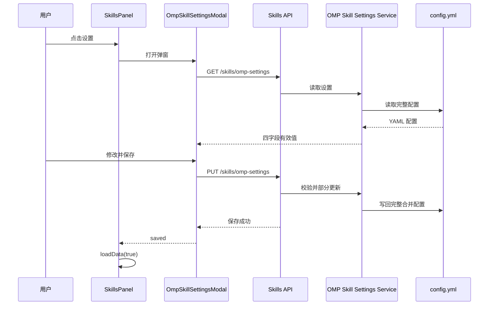

# OMP 技能扫描设置设计

## 目标

在技能管理界面为 OMP 平台提供独立的扫描来源设置入口。用户可以控制 OMP 技能发现是否扫描 Codex 用户目录、Claude 用户及插件目录、OMP 用户及插件目录、当前项目 `.omp/skills`，并在保存后立即刷新当前技能列表。

本功能不展示、读取或写入 `skills.enabled`。现有 `skills.enabled` 以及所有未列入本功能白名单的配置必须原样保留。

## 范围

### 包含

- OMP 平台下，SkillsPanel 独立页和抽屉页工具栏均显示“设置”按钮。
- 非 OMP 平台不显示该入口。
- 新增窄幅“技能扫描设置”弹窗。
- 新增专用 `GET /api/skills/omp-settings` 与 `PUT /api/skills/omp-settings`。
- 持久化 OMP `config.yml` 中 `skills` 节点的四个白名单字段。
- 保存成功后强制刷新当前技能列表。
- API 与前端交互回归测试。

### 不包含

- `skills.enabled` 总开关。
- Claude 项目、Agents、customDirectories、includeSkills、ignoredSkills 等其他 OMP Skills 配置。
- 通用 SettingsDrawer 集成。
- 修改 OMP 技能发现本身的扫描算法。

## 配置模型

API 仅暴露以下四个布尔字段：

```js
{
  enableCodexUser: true,
  enableClaudeUser: true,
  enablePiUser: true,
  enablePiProject: true
}
```

含义：

- `enableCodexUser`：扫描 Codex 用户 Skills。
- `enableClaudeUser`：扫描 Claude 用户 Skills 与 Claude 插件 Skills。
- `enablePiUser`：扫描 OMP 用户 Skills 与 OMP 插件 Skills。
- `enablePiProject`：扫描当前项目 `.omp/skills`。

任一字段在持久化配置中缺失时，GET 返回 `true`。默认值只补齐 API 响应，不要求 GET 写盘。

## 前端设计

### 入口

SkillsPanel 根据 `currentPlatform === 'omp'` 决定是否渲染“设置”按钮。按钮加入现有 `asset-action-row`：

- 独立页头部工具栏可用。
- 抽屉页工具栏可用。
- 其他平台完全不渲染按钮，而不是仅禁用。

入口逻辑沿用 SkillsPanel 已有的平台解析结果，避免建立第二套平台判断。

### 设置弹窗

新增独立 `OmpSkillSettingsModal` 组件，职责仅包括读取、编辑和保存四个扫描来源。SkillsPanel 只负责控制可见性，并在组件发出保存成功事件后刷新列表。

弹窗设计：

- 标题：`技能扫描设置`。
- 宽度约 420px，并受视口最大宽度约束。
- 分组标题：`扫描来源`。
- 四行开关，每行包含主标签和简短说明。
- 底部操作：`取消`、`保存`。

打开弹窗时立即请求实际持久化值。读取期间显示加载状态，避免用户编辑尚未初始化的表单。

### 交互状态

- 读取成功：以 GET 返回值初始化四个开关。
- 读取失败：显示错误提示，不修改 SkillsPanel 已有技能列表；弹窗保留错误状态，允许关闭后重试。
- 保存期间：四个开关、取消、关闭与保存操作全部禁用，防止并发写入或丢失提交状态。
- 保存成功：显示成功提示，关闭弹窗，并等待 `loadData(true)` 完成以强制刷新当前列表。
- 保存失败：显示错误提示，弹窗保持打开，保留用户当前表单值，不刷新列表。

## 服务端设计

### 专用服务边界

新增聚焦于 OMP 技能设置的服务模块，提供：

- 读取并补齐四个默认值。
- 校验 PUT 请求。
- 将部分更新合并进现有 `skills` 节点。
- 调用现有 OMP YAML 配置读写能力持久化结果。

Skills API 路由仅负责 HTTP 状态和响应封装，不直接实现白名单合并规则。

### GET `/api/skills/omp-settings`

成功响应：

```json
{
  "success": true,
  "settings": {
    "enableCodexUser": true,
    "enableClaudeUser": true,
    "enablePiUser": true,
    "enablePiProject": true
  }
}
```

读取现有 `config.yml` 的 `skills` 节点，仅选择白名单字段。缺失字段返回默认值 `true`。顶层配置不存在或 `skills` 节点不存在时，同样返回四项默认值。

底层读取错误交由统一 API 错误处理返回失败响应，不用空配置掩盖真实持久化错误。

### PUT `/api/skills/omp-settings`

请求体允许只包含一个或多个白名单字段，例如：

```json
{
  "enablePiProject": false
}
```

验证规则：

- 请求体必须是普通对象，不能是数组或 `null`。
- 每个键必须属于四字段白名单。
- 每个值必须是布尔值。
- 空对象允许作为无变化的有效部分更新，并返回当前有效设置。
- 任一字段非法时整体返回 400，且不得写盘。

写入步骤：

1. 读取完整 OMP 配置对象。
2. 将现有 `skills` 视为对象；若缺失则使用空对象。
3. 仅把请求中的白名单字段浅合并到现有 `skills`。
4. 将合并后的 `skills` 放回完整配置对象。
5. 通过现有 YAML 写入能力写回 `config.yml`。
6. 返回补齐默认值后的四字段设置。

该流程必须保留：

- `skills.enabled`。
- `skills` 节点中的其他字段。
- 整个配置文件的其他顶层节点。

## 数据流



## 错误处理

- API 校验错误使用 400，并返回项目统一的失败响应格式。
- YAML 读取或写入错误使用现有统一错误处理，不返回伪成功。
- 非法 PUT 在校验完成前不得调用写入函数。
- 前端读取或写入失败均不触发技能列表刷新。
- 前端错误提示包含操作上下文，如“加载技能扫描设置失败”或“保存技能扫描设置失败”。
- 设置请求与技能列表请求彼此独立，设置失败不得清空或替换当前 `skills` 状态。

## 测试策略

严格按红、绿、重构顺序实现。

### 服务端/API 回归

先编写并运行失败测试，再实现：

1. 空配置和缺失字段时，GET 返回四项 `true`。
2. PUT 部分更新只改变请求字段。
3. PUT 保留 `skills.enabled`、其他 skills 字段和顶层无关字段。
4. PUT 包含未知字段时返回 400，配置文件内容不变。
5. PUT 包含非布尔值时返回 400，配置文件内容不变。
6. 空对象 PUT 不破坏配置，并返回当前有效设置。

### 前端回归

当前 Web 包没有 Vue Test Utils 或 DOM 测试环境。为避免仅通过源代码文本断言，将平台入口判断和保存编排提取为可在现有 Vitest Node 环境直接测试的轻量辅助模块。测试覆盖：

1. OMP 平台允许显示设置入口。
2. 非 OMP 平台不允许显示设置入口。
3. 保存成功只触发一次 `loadData(true)`。
4. 读取失败不触发刷新，并保留当前技能列表。
5. 写入失败不触发刷新，并保留当前技能列表。

组件模板继续通过 Web 生产构建验证 Vue 模板、导入和类型形态是否有效。

## 验收标准

- OMP 独立技能页和技能抽屉均可打开扫描设置。
- 非 OMP 平台看不到设置入口。
- 弹窗只展示四个来源开关，不展示总开关。
- 缺失配置默认显示为启用。
- 保存过程中无法重复提交或关闭弹窗。
- 成功保存后出现成功提示，弹窗关闭，当前技能列表强制刷新。
- 读取或写入失败时已有技能列表保持不变，并显示明确错误。
- PUT 不会覆盖任何非白名单配置。
- 非法字段或非法值被拒绝，且配置文件不发生变化。
- 定向 Vitest 测试通过，Web 生产构建通过。
